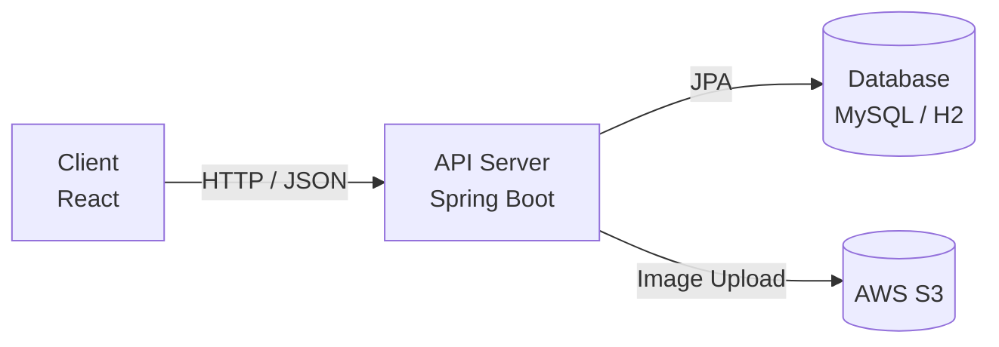
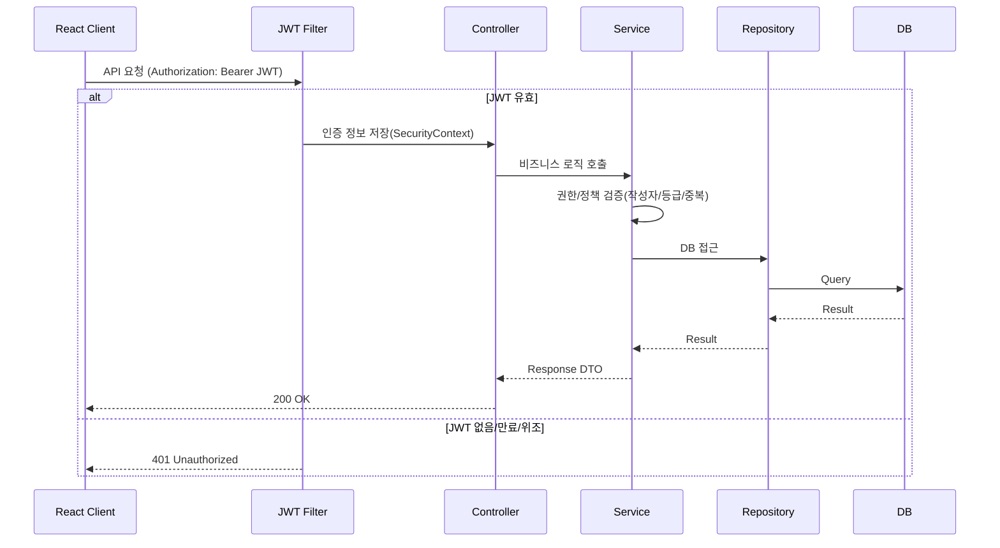

# Spring Boot REST API 게시판 프로젝트

> **URL 조작, 권한 우회, 중복 요청과 같은 사용자 행위를  
서버 단에서 어떻게 책임지고 차단할 것인가를 고민한  
React + Spring Boot 기반 REST API 게시판 프로젝트**
---

## 이 프로젝트를 만든 이유

게시판 기능을 구현하던 중,  
**URL만 변경해도 다른 사용자의 게시글이 수정·삭제될 수 있는 구조적 위험**을 경험했습니다.

화면 단에서 버튼을 숨기거나 경로를 막는 방식은  
직접 API 호출이나 URL 조작 앞에서는 무력하다고 판단했고,  
“**서버는 어디까지 책임져야 하는가**”라는 질문에서 이 프로젝트를 시작했습니다.

이 프로젝트는 단순한 게시판 구현이 아니라,  
다음과 같은 문제를 **서버 단에서 구조적으로 해결하는 것**을 목표로 합니다.

- URL 조작에 의한 권한 우회 차단
- 좋아요와 같은 중복 요청 방지
- 게시판 카테고리별 권한 정책의 일관된 관리
- 프론트엔드 분리 환경에서의 안전한 인증 구조
---

## 🤔 기술적 의사결정 (Why)

### 왜 JWT 기반 인증을 선택했는가?
본 프로젝트는 React와 Spring Boot를 분리한 구조이기 때문에  
서버 세션에 의존하지 않는 **Stateless 인증 방식**이 필요했습니다.

JWT를 사용함으로써  
- 서버가 세션 상태를 관리하지 않아도 되고  
- REST API 구조에 자연스럽게 적용할 수 있으며  
- 매 요청마다 서버에서 인증을 검증해  
  **클라이언트 요청을 신뢰하지 않는 구조**를 만들 수 있다고 판단했습니다.

### 왜 Service 계층에서 권한을 검증하는가?
초기에는 Controller나 프론트엔드에서 권한을 제어하려 했지만,  
URL 조작이나 직접 API 호출로 **쉽게 우회가 가능하다는 한계**를 발견했습니다.

이후 모든 권한 검증 로직을 **Service 계층으로 이동**시켜  
어떤 경로로 요청이 들어오더라도  
**비즈니스 규칙은 반드시 Service를 통과하도록 구조를 재설계**했습니다.

### 왜 게시판 정책을 Enum + Service로 관리했는가?
게시판 카테고리(GREETING / FREE / GOLD)가 늘어날수록  
조건 분기가 흩어지면 유지보수가 어려워질 수 있다고 판단했습니다.

카테고리와 사용자 등급을 Enum으로 명확히 정의하고,  
Service 계층에서 정책을 중앙 집중 관리함으로써  
확장과 변경에 유연한 구조를 목표로 설계했습니다.

---
## 실제로 고민한 문제들

### 1) URL 조작에 의한 게시글 권한 우회
- 게시글 수정/삭제 API에서 URL의 게시글 ID만 변경해도  
  타인의 게시글에 접근 가능한 문제

### 2) 좋아요 중복 요청 문제
- 버튼 반복 클릭 또는 API 재요청으로  
  중복 데이터가 저장될 수 있는 위험

### 3) 화면 제어에 의존한 권한 검증의 한계
- 프론트엔드에서 버튼을 숨겨도  
  직접 API 호출은 막을 수 없음
---

## 이 프로젝트의 차별점

- **모든 권한 검증을 Service 계층에서 처리**
- 좋아요 중복 방지: **Service 검증 + DB 유니크 제약** 이중 방어
- 게시판 정책을 **Enum + Service 로직으로 중앙 집중 관리**
- JWT 기반 Stateless 인증으로 **프론트엔드 요청을 신뢰하지 않는 구조**

---

## 기술 스택

### Backend
- Java 17
- Spring Boot
- Spring Security
- Spring Data JPA
- JWT (Stateless)
- MySQL / H2

### Frontend
- React
- Axios
- Vite

### Infra / Tool
- Gradle
- Git / GitHub
- AWS S3 (이미지 업로드)

---

## 📂 프로젝트 구성

```text
boardapi/
├─ board/        # Spring Boot REST API 서버
└─ frontend/     # React 클라이언트

```


---

## 🏗 아키텍처

### 시스템 구성도


### 요청 처리 흐름 (JWT 인증/인가)


## 🛠 Troubleshooting

### 문제: 게시판 카테고리별 권한 제어가 깨지는 문제

#### 🔍 문제 상황
게시판은 `GREETING`, `FREE`, `GOLD` 카테고리로 나뉘며  
각 카테고리마다 접근/작성 권한이 달라야 했습니다.

초기 구현에서는  
- Controller 단에서 권한을 분기하거나  
- 프론트엔드에서 버튼 노출 여부로 제어했습니다.

그러나 이 방식은  
- URL을 직접 호출하거나  
- API 요청을 조작할 경우  
**권한이 쉽게 우회되는 문제**가 있었습니다.

#### ❗ 문제의 본질
권한 검증 로직이 여러 계층에 흩어져 있었고,  
“어디에서 권한을 책임져야 하는지” 기준이 명확하지 않았습니다.

#### ✅ 해결 방법
모든 게시판 권한 정책을 **Service 계층으로 집중**시켰습니다.

- 게시판 카테고리(`BoardCategory`)와 사용자 등급(`UserRole`)을 기준으로
- Service에서 명시적으로 접근/작성 권한을 검증
- 어떤 경로로 요청이 들어와도 **Service를 통과하지 않으면 처리되지 않도록 설계**

```java
private void validateWritePermission(BoardCategory category, User user) {
    UserRole role = user.getUserRole();

    switch (category) {
        case GREETING:
            if (role != BRONZE && role != ADMIN) {
                throw new AccessDeniedException();
            }
            break;
        case FREE:
            if (role != SILVER && role != GOLD && role != ADMIN) {
                throw new AccessDeniedException();
            }
            break;
        case GOLD:
            if (role != GOLD && role != ADMIN) {
                throw new AccessDeniedException();
            }
            break;
    }
}
```
### 결과
- URL 조작/직접 호출로도 권한 우회 불가
- 정책이 한 곳에 모여 유지보수 용이
- 새로운 게시판 카테고리 추가 시 확장 쉬움
이 경험을 통해
**“권한은 화면이 아니라 서버가 끝까지 책임져야 한다”**는 기준을 갖게 되었습니다.

---

## 🧪 테스트
- Mockito 기반 Service 단위 테스트
- 권한 검증, 검색 분기, 이미지 교체 로직 테스트

## 🚀 실행 방법
### 1) 백엔드 실행 (board)
```bash
cd board
./gradlew bootRun
```

### 2) 프론트 실행 (frontend)
```bash
cd frontend
npm install
npm run dev
```
---

### 🔐 보안 및 환경 변수
민감 정보(AWS Key, JWT Secret, DB 비밀번호)는 GitHub에 포함하지 않고
환경 변수 또는 별도 설정 파일로 분리하는 것을 권장합니다.

---

### 💬 프로젝트를 통해 느낀 점
이 프로젝트를 통해
“기능이 구현됐다”와 “서비스로 안전하다”는 전혀 다르다는 점을 체감했습니다.

이후에는 항상
요청이 악용될 가능성을 먼저 고려하고,
서버가 비즈니스 규칙을 끝까지 책임지는 개발 방식을 지향하고 있습니다.
---
