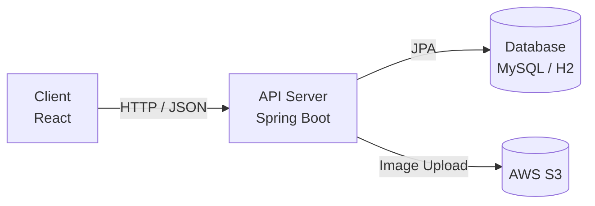
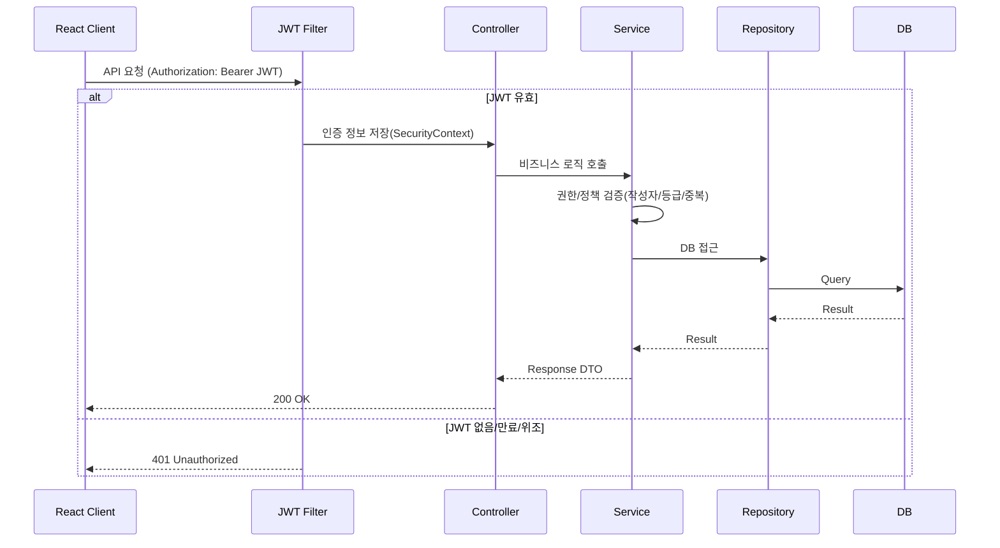

# Spring Boot REST API 게시판 프로젝트

> **URL 조작·중복 요청과 같은 사용자 행위를 서버 단에서 차단하는 데 집중한  
React + Spring Boot 기반 REST API 게시판 프로젝트**

---

## 이 프로젝트를 만든 이유

게시판 기능을 구현하던 중,  
**URL만 변경해도 다른 사용자의 게시글을 수정·삭제할 수 있는 구조적 위험**을 경험했습니다.  
화면 단 제어만으로는 이를 근본적으로 막을 수 없다고 판단했고,  
**서버가 어디까지 책임져야 하는지**를 기준으로 프로젝트를 재설계했습니다.

이 프로젝트는 다음 문제를 **서버 단에서 해결**하는 것을 목표로 합니다.

- URL 조작에 의한 **권한 우회 방지**
- 좋아요와 같은 **중복 요청 방지**
- 게시판 카테고리별 **권한 정책을 서버에서 일관되게 관리**
- JWT 기반 인증으로 **프론트/백엔드 완전 분리**

---

## 실제로 고민한 문제들

### 1) URL 조작에 의한 권한 우회
- 게시글 수정/삭제 API에서 URL의 게시글 ID만 변경하면  
  타인의 게시글도 수정될 수 있는 문제

### 2) 좋아요 중복 요청 문제
- 좋아요 버튼 반복 클릭/요청 시 중복 데이터 저장 위험

### 3) 화면 제어 의존의 한계
- 버튼 숨김만으로는 직접 API 호출을 막을 수 없음

---

## 이 프로젝트의 차별점

- **Service 계층에서 권한 검증(작성자 검증)으로 우회 요청 차단**
- **좋아요 중복 방지: Service 검증 + DB 제약(유니크)로 이중 방어**
- 게시판 정책(등급/카테고리)을 **Enum + Service 로직으로 중앙 집중 관리**
- JWT 기반 Stateless 인증으로 **클라이언트 요청을 신뢰하지 않는 구조**

---

## 기술 스택

### Backend
- Java 17
- Spring Boot
- Spring Security
- Spring Data JPA
- JWT (Stateless)
- MySQL / H2

### Frontend
- React
- Axios
- Vite

### Infra / Tool
- Gradle
- Git / GitHub
- AWS S3 (이미지 업로드)

---

## 🤔 기술적 의사결정 (Why)

### 왜 JWT 기반 인증을 선택했는가?
본 프로젝트는 React와 Spring Boot를 분리한 구조로 설계되었기 때문에  
세션 기반 인증보다는 **Stateless한 인증 방식이 필요**했습니다.

JWT를 사용함으로써  
- 서버 세션 상태를 유지하지 않아도 되고  
- REST API 구조에 자연스럽게 녹아들며  
- 클라이언트 요청을 신뢰하지 않고 **매 요청마다 서버에서 인증을 검증**할 수 있다고 판단했습니다.

### 왜 Service 계층에서 권한을 검증하는가?
초기 구현에서는 Controller 또는 화면 단에서 권한을 제어하려 했으나,  
URL 조작이나 직접 API 호출로 **쉽게 우회가 가능하다는 한계**를 발견했습니다.

이후 모든 권한 검증 로직을 **Service 계층으로 이동**시켜  
“어떤 경로로 들어오더라도 서버가 최종 책임을 진다”는 기준으로 구조를 재설계했습니다.

### (선택) 왜 Querydsl/동적 조회 구조를 고려했는가?
게시판 목록 조회에서 정렬 조건, 검색 조건이 늘어날 가능성을 고려해  
조건 분기에 유연한 조회 구조가 필요하다고 판단했습니다.

현재는 Repository 메서드 조합으로 구현했지만,  
확장 시 Querydsl 기반 동적 쿼리로 자연스럽게 전환 가능한 구조를 염두에 두고 설계했습니다.

---

## 📂 프로젝트 구성
```text
boardapi/
├─ board/        # Spring Boot REST API 서버
│  ├─ build.gradle
│  └─ src/
│     ├─ main/
│     │  ├─ java/
│     │  │  └─ spboard/board/
│     │  │     ├─ controller/
│     │  │     ├─ service/
│     │  │     ├─ repository/
│     │  │     ├─ domain/
│     │  │     └─ config/
│     │  └─ resources/
│     │     └─ application.yml
│     └─ test/
│        └─ java/
│           └─ spboard/board/
│              └─ service/
│
└─ frontend/     # React 클라이언트
   ├─ package.json
   └─ src/
      ├─ api/
      ├─ components/
      └─ pages/

```


---

## 🏗 아키텍처

### 시스템 구성도


### 요청 처리 흐름 (JWT 인증/인가)



## 🧩 핵심 구현 포인트
### 1) 게시글 수정/삭제 권한 검증 (URL 우회 방지)
- 로그인 사용자와 작성자 일치 여부를 Service에서 검증
- URL 조작으로 들어오는 요청도 서버에서 최종 차단

```java
        if (board.getUser() == null || !board.getUser().getLoginId().equals(loginId)) {
            throw new SecurityException("수정 권한이 없습니다.");
        }
```
### 2) 좋아요 중복 방지
- Service 계층에서 중복 여부 사전 검증
- DB 유니크 제약으로 이중 방어
```java
    public Boolean existsLike(String loginId, Long boardId) {
        return likeRepository.existsByUser_LoginIdAndBoardId(loginId, boardId);
    }
```
### 3) 게시판 카테고리별 권한 정책
- GREETING / FREE / GOLD 게시판 정책을 Service 계층에서 명시적으로 관리
---

## 🧪 테스트
- Mockito 기반 Service 단위 테스트
- 주요 검증 로직(권한/검색 분기/이미지 교체/접근 제한) 테스트
“기능이 된다”가 아니라 **“잘못된 요청이 차단되는가”**를 기준으로 작성했습니다.

## 🚀 실행 방법
### 1) 백엔드 실행 (board)
```bash
cd board
./gradlew bootRun
```

### 2) 프론트 실행 (frontend)
```bash
cd frontend
npm install
npm run dev
```
---

### 🔐 환경 변수 / 보안
민감 정보(AWS Key, JWT Secret, DB 비밀번호)는 GitHub에 포함하지 않고
환경 변수 또는 별도 설정 파일로 분리하는 것을 권장합니다.

예시:
- AWS_ACCESS_KEY, AWS_SECRET_KEY
- JWT_SECRET
- DB_URL, DB_USERNAME, DB_PASSWORD
---

### 🔧 개선 및 확장 포인트
- 예외 처리 공통화(@ControllerAdvice)
- 테스트 커버리지 확대
- Refresh Token 도입
- 관리자 통계 API 고도화
---

### 💬 프로젝트를 통해 느낀 점
이 프로젝트를 통해
“기능이 구현됐다”와 “서비스로 안전하다”는 다르다는 점을 체감했습니다.

이후에는 요청이 악용될 가능성을 먼저 고려하고,
서버가 비즈니스 규칙을 끝까지 책임지는 설계를 지향합니다.
---
