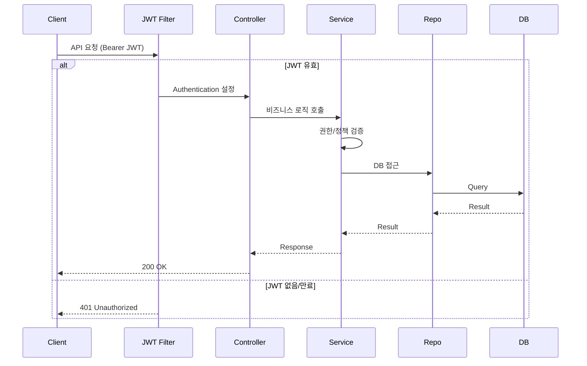

# Spring Boot REST API 게시판 프로젝트

Spring Boot 기반 REST API 게시판 프로젝트입니다.  
단순 기능 구현이 아니라 **서버가 클라이언트 요청을 끝까지 책임지는 구조**를 만드는 것을 목표로 개발했습니다.

---

## 이 프로젝트를 만든 이유

웹 서비스를 사용하며 느낀 점은  
화면(UI)에서 막아둔 기능도 URL 직접 호출이나 API 조작을 통해
언제든지 우회될 수 있다는 점이었습니다.

그래서 이 프로젝트는 단순한 게시판 구현이 아닌,  
**“클라이언트 요청을 신뢰하지 않는 서버 구조”**를 직접 설계하고 구현하는 것을 목표로 시작했습니다.

특히 다음과 같은 문제를 해결하고자 했습니다.

- 화면 제어에 의존하지 않고 **서버에서 권한을 검증하는 구조**
- 중복 요청, 악의적인 요청에도 **데이터 무결성이 깨지지 않는 설계**
- 기능이 늘어나도 규칙이 흩어지지 않는 **Service 중심의 비즈니스 로직**

이를 통해 “기능이 동작하는 코드”가 아니라  
**“실제 서비스로 운영 가능한 코드”를 만드는 경험**을 목표로 했습니다.

---

## 🎯 Project Goals

- REST API 기반 게시판 시스템 설계
- JWT 기반 인증/인가 구조 구현
- Service 계층 중심의 권한 검증 로직 설계
- DB 제약 조건을 활용한 데이터 무결성 보장
- 문제 상황을 기록하고 개선한 Troubleshooting 경험 축적

---

## 기술 스택

### Backend
- Java 17
- Spring Boot
- Spring Security
- Spring Data JPA
- JWT (Authentication / Authorization)

### Frontend
- React
- Axios
- Vite

### Database
- MySQL

### Tool
- Postman
- Gradle
- Git / GitHub
---

## 🤔 기술적 의사결정 (Why)

### Spring Boot
인증, 보안, 트랜잭션 등 백엔드 서비스에 필수적인 기능을
안정적으로 구성할 수 있어 선택했습니다.

Controller → Service → Repository 계층을 명확히 분리하여
요청 검증 로직을 어디에 두어야 유지보수가 쉬운지를 고민하며 설계했습니다.

### Spring Data JPA
단순 CRUD 구현을 넘어서,
- 엔티티 중심 설계
- 연관관계 매핑
- 트랜잭션 단위 데이터 처리

를 직접 경험하기 위해 JPA를 사용했습니다.

특히 N+1 문제, Fetch 전략 등
ORM 사용 시 발생할 수 있는 대표적인 문제를 인지하고 해결하는 것을 학습 목표로 삼았습니다.

### MySQL
유니크 제약, 외래키 등을 활용해
**애플리케이션 로직 + DB 제약으로 데이터 무결성을 함께 보장하는 설계**를 연습하기 위해 선택했습니다.

---

## ✨ Key Features

### 회원 / 인증
- 회원 가입 / 로그인
- JWT 기반 인증 처리
- Role 기반 접근 제어

### 게시판
- 게시글 CRUD
- 카테고리별 게시판 분리
- 작성자만 수정/삭제 가능

### 좋아요
- 게시글 좋아요 기능
- 사용자당 게시글 1회만 가능
- 중복 요청 방지 로직 구현

---

## 📂 프로젝트 구성

```text
boardapi/
├─ board/        # Spring Boot REST API 서버
└─ frontend/     # React 클라이언트

```

---

## 🏗 아키텍처
```text
Client
↓
Controller (Request / Response)
↓
Service (Business Logic & Authorization)
↓
Repository (JPA)
↓
MySQL
```

- 인증 및 권한 검증은 **Service 계층에서 처리**
- Controller는 요청 전달과 응답 책임만 수행
- 비즈니스 규칙이 한 곳에 모이도록 설계

```mermaid
flowchart LR
  Client[React | Postman] -->|HTTP| API[Spring Boot REST API]
  API --> Filter[JwtAuthenticationFilter]
  Filter --> Controller
  Controller --> Service
  Service --> Repository
  Repository --> MySQL[(Database)]
```

(※ 추후 docs/architecture.png 추가 예정)

---

## 🗂 ERD
- User ↔ Board ↔ Like 연관관계
- (user_id, board_id) 유니크 제약으로 좋아요 중복 방지


(※ 추후 docs/erd.png 추가 예정)

---

### 요청 처리 흐름 (JWT)



## 🛠 Troubleshooting (핵심 문제 해결)

### 1️⃣ 인증 실패와 권한 부족이 구분되지 않던 문제

**문제 상황**
- 인증 실패와 권한 부족이 동일한 에러로 처리됨

**해결**
- JWT 인증 필터 적용
- 인증 실패(401)와 권한 부족(403) 응답 분리

**결과**
- 인증 여부와 권한 상태를 명확히 구분 가능
  


- JWT 인증 후 요청 → **200 OK**
  


---

### 2️⃣ 게시판 카테고리 권한 우회 문제

**문제 상황**
- 프론트엔드 제어 또는 Controller 분기로 권한 처리
- URL 직접 호출로 권한 우회 가능

**해결**
- 모든 게시판 접근 정책을 **Service 계층에서 중앙 관리**
- 카테고리 + 사용자 등급 기준으로 서버에서 최종 검증

**검증 결과**

- SILVER 사용자가 GOLD 게시판 작성 시 → **403 Forbidden**
  


### 3. 좋아요 중복 처리 문제

#### 문제 상황
- 동일 사용자의 중복 좋아요 요청으로 카운트 증가

#### 해결
- Service 계층에서 좋아요 존재 여부 검증
- DB 레벨에서 (user_id, board_id) 유니크 제약 적용

```java
likeRepository.existsByUser_LoginIdAndBoardId(loginId, boardId);
```
이를 통해 로직 검증 + DB 제약이라는
이중 안전장치 구조를 적용했습니다.

**결과**
- 로직 + DB 제약의 이중 안전장치 구조 확보

---

## 🧪 테스트
- JUnit5 기반 테스트 환경 구성
- Service 계층 단위 테스트 작성
- 권한 검증 및 비즈니스 로직 테스트 포함

---

### 💬 프로젝트를 통해 느낀 점
- 서버는 클라이언트 요청을 신뢰해서는 안 된다
- 권한 검증은 Controller가 아닌 **Service 책임**
- 데이터 무결성은 **로직 + DB 제약**으로 함께 보장해야 한다
- “기능이 된다”와 “서비스로 안전하다”는 전혀 다르다

---

### Links
- GitHub Repository: https://github.com/JeongEuiHan/boardapi-project
