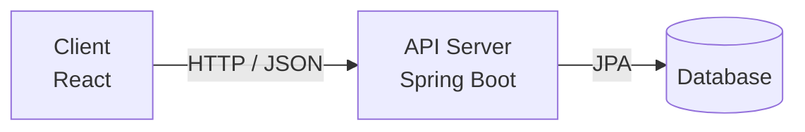
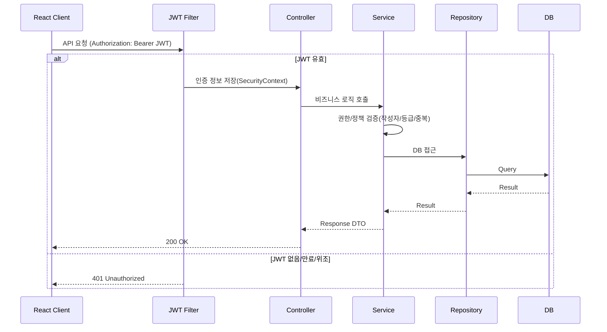

# Spring Boot REST API 게시판 프로젝트

> **URL 조작, 권한 우회, 중복 요청과 같은 사용자 행위를  
서버 단에서 어떻게 책임지고 차단할 것인가를 고민한  
React + Spring Boot 기반 REST API 게시판 프로젝트**
---

## 이 프로젝트를 만든 이유

게시판 기능을 구현하던 중,  
**URL만 변경해도 다른 사용자의 게시글이 수정·삭제될 수 있는 구조적 위험**을 경험했습니다.

초기에는 화면 단에서 버튼을 숨기거나 Controller에서 조건 분기를 추가했지만,  
직접 API 호출이나 URL 조작 앞에서는 쉽게 우회될 수 있다는 한계를 느꼈습니다.

이 프로젝트는 단순한 CRUD 구현이 아니라,  
**“서버는 어디까지 책임져야 하는가”**라는 질문에서 출발했습니다.

- 프론트엔드 요청을 신뢰하지 않는 구조
- 어떤 경로로 들어오더라도 서버가 최종 검증
- 잘못된 요청을 **정상 동작이 아닌 실패로 명확히 처리**

위 기준을 중심으로 프로젝트를 설계했습니다.

---

## 🤔 기술적 의사결정 (Why)

### 왜 JWT 기반 인증을 선택했는가?
본 프로젝트는 React와 Spring Boot를 분리한 구조이기 때문에  
서버 세션에 의존하지 않는 **Stateless 인증 방식**이 필요했습니다.

JWT를 사용함으로써  
- 서버가 세션 상태를 관리하지 않아도 되고
- REST API 구조에 자연스럽게 녹아들며
- 매 요청마다 서버에서 인증을 검증할 수 있다고 판단했습니다

### 왜 Service 계층에서 권한을 검증하는가?
Controller나 프론트엔드에서의 권한 제어는  
URL 조작이나 직접 API 호출로 쉽게 우회될 수 있습니다.

이에 따라 모든 권한 검증 로직을 **Service 계층으로 집중**시켜  
“어떤 요청이든 Service를 통과하지 않으면 처리되지 않도록” 구조를 재설계했습니다.

### 왜 게시판 정책을 Enum + Service로 관리했는가?
게시판 카테고리(GREETING / FREE / GOLD)가 늘어날수록  
조건 분기가 흩어지면 유지보수가 어려워질 수 있다고 판단했습니다.

카테고리와 사용자 등급을 Enum으로 명확히 정의하고,  
Service 계층에서 정책을 중앙 집중 관리함으로써  
확장과 변경에 유연한 구조를 목표로 설계했습니다.

---

## 이 프로젝트의 차별점

- JWT 기반 **Stateless 인증**
- 인증(401)과 권한(403)을 명확히 구분
- 모든 권한 검증을 **Service 계층에서 처리**
- 게시판 카테고리별 권한 정책 중앙 관리
- 좋아요 중복 방지: **Service 검증 + DB 유니크 제약** 이중 방어

---

## 기술 스택

### Backend
- Java 17
- Spring Boot
- Spring Security
- Spring Data JPA
- JWT (Stateless)
- MySQL / H2

### Frontend
- React
- Axios
- Vite

### Infra / Tool
- Gradle
- Git / GitHub
- Postman

---

## 📂 프로젝트 구성

```text
boardapi/
├─ board/        # Spring Boot REST API 서버
└─ frontend/     # React 클라이언트

```

---

## 🏗 아키텍처

### 시스템 구성도



### 요청 처리 흐름 (JWT)


## 🛠 Troubleshooting (핵심 문제 해결)

### 1️⃣ JWT 인증이 없는 요청을 구분하지 못하던 문제

**문제 상황**
- 인증 여부에 대한 명확한 기준 없이 API가 처리됨
- 인증 실패와 권한 부족이 동일한 에러로 보이는 구조

**해결**
- 모든 요청에 JWT 인증을 적용
- 인증 실패(401)와 권한 부족(403)을 명확히 분리

**검증 결과**

- 인증 없이 요청 → **401 Unauthorized**
  


- JWT 인증 후 요청 → **200 OK**
  


---

### 2️⃣ 게시판 카테고리별 권한이 우회 가능한 문제

**문제 상황**
- 프론트엔드 제어 또는 Controller 분기로 권한 처리
- URL 조작이나 직접 API 호출로 권한 우회 가능

**해결**
- 모든 게시판 권한 정책을 **Service 계층에서 중앙 관리**
- 카테고리 + 사용자 등급 기준으로 서버에서 최종 검증

**검증 결과**

- SILVER 사용자가 GOLD 게시판 작성 시 → **403 Forbidden**
  


---

**결과**
- 인증(401)과 권한(403)을 명확히 구분
- 프론트엔드에 의존하지 않는 서버 책임 구조 확보

---

## 🧪 테스트
- Mockito 기반 Service 단위 테스트
- 권한 검증, 검색 분기, 이미지 교체 로직 테스트

## 🚀 실행 방법
### 1) 백엔드 실행 (board)
```bash
cd board
./gradlew bootRun
```

### 2) 프론트 실행 (frontend)
```bash
cd frontend
npm install
npm run dev
```
---

### 🔐 보안 및 환경 변수
민감 정보(AWS Key, JWT Secret, DB 비밀번호)는 GitHub에 포함하지 않고
환경 변수 또는 별도 설정 파일로 분리하는 것을 권장합니다.

---

### 💬 프로젝트를 통해 느낀 점
이 프로젝트를 통해
“기능이 구현됐다”와 “서비스로 안전하다”는 전혀 다르다는 점을 체감했습니다.

이후에는 항상
요청이 악용될 가능성을 먼저 고려하고,
서버가 비즈니스 규칙을 끝까지 책임지는 개발 방식을 지향하고 있습니다.

---
